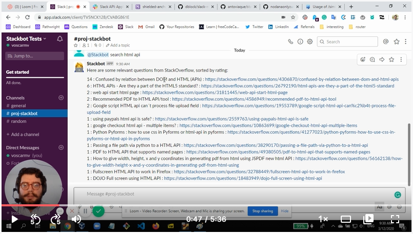
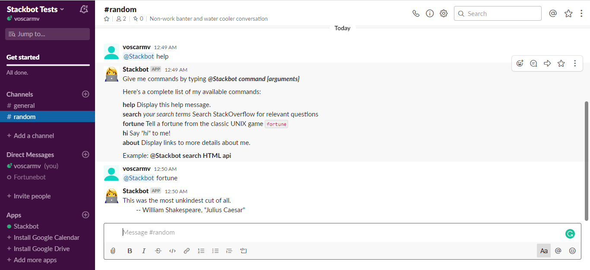
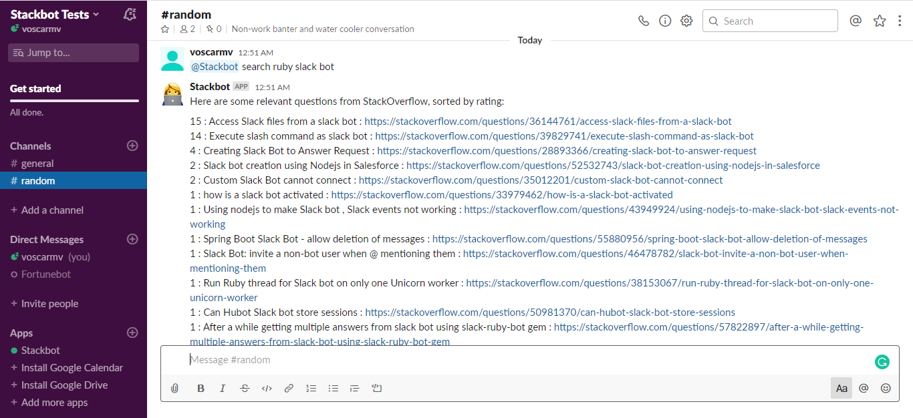

# Stackbot

> A bot for Slack that can search StackOverflow questions and display [UNIX fortunes](https://en.wikipedia.org/wiki/Fortune_(Unix)).

I decided to create a Slack bot that could search StackOverflow for questions because I mostly use Slack for discussing web development with my teammates. It's handy to have a StackOverflow search available in the middle of a discussion about bugs or computer errors.

I also added a UNIX fortune functionality, just to keep the project fun and entertaining. Fortune outputs sometimes sarcistic or interesting phrases on the screen. This way you won't get bored while you're debugging your code :)

# Video Presentation

[](https://www.loom.com/share/6eb07336320d4518b695d1cc923f4d06)

# Screenshots





## Built With

- Ruby 2.6.5p114 
- Rubocop 0.80.1
- RSpec 3.9
- Visual Studio Code 1.42.1

## Live Demo

A live Demo is currently unavailable as it would require a Premium Heroku account.


## Getting Started

It is possible to test Stackbot locally as well as remotely by deploying it to Heroku. You will need both a [Slack](https://www.slack.com) and a [Heroku](https://www.heroku.com) account for this. To get a local copy up and running follow these simple example steps.

### Prerequisites

Make sure you have the following packages installed before continuing:

```
$ sudo apt install ruby-full heorku
$ gem install bundler rspec
```

### Setup

In order to test Stackbot you will need to [create a Slack APP](https://api.slack.com/apps/new). Once you've created the app, [configure it as a bot](https://api.slack.com/bot-users) and install it to your preferred Slack workspace. Don't forget to [save it's API token](https://api.slack.com/authentication/token-types#bot) somewhere. You will need the token in order to test the bot.

### Install

To test Stackbot locally, clone the repository, navigate to it's containing directory, and run:

```
$ bundle install
$ echo 'SLACK_API_TOKEN=your_token_here' > .env
$ foreman start
```

This should install all ruby gems, generate an `.env` file containing the API token from the Setup, and start a local server where Stackbot will live.

### Usage

Once Stackbot is running either locally or remotely in Heroku, you can log into the Slack workspace where you installed it and invite it to your channel by typing `/invite @Stackbot`.

Typing `@Stackbot help` will display the following message:

>Give me commands by typing _**@Stackbot command [arguments]**_
>
>Here's a complete list of my available commands:
>
>**help** Display this help message.  
>**search** _your search terms_ Search StackOverflow for relevant questions  
>**fortune** Tell a fortune from the classic UNIX game `fortune`  
>**hi** Say _"hi"_ to me!  
>**about** Display links to more details about me.  
>
>Example: **@Stackbot search HTML api**

You may try any such commands on Slack.

### Run tests

Running `rspec` will test the previous functionalities. You will need to be connected to the internet to run the tests. Navigate the `spec` directory to find out how the tests are performed. Testing currently returns the following results:

```
SlackStackbot::Commands::Default
  lowercase
  capitalized
  with about argument

SlackStackbot::Commands::Fortune
  fortune is contained in fortune file

SlackStackbot::Commands::Help
  help

SlackRubyBot::Commands::Hi
  says hi

SlackStackbot::Commands::Search
  StackOverflow search returns some results
  StackOverflow search returns no results
  Search terms missing

SlackStackbot
  has a version

Finished in 2.09 seconds (files took 1.74 seconds to load)
10 examples, 0 failures
```

### Deployment

You may deploy Stackbot on Heroku by running the following commands in the repo directory:

```
$ heroku create
$ git push heroku master
$ heroku config:add SLACK_API_TOKEN=your_token_here
$ heroku ps:scale web=1
$ heroku open
```

This should keep Stackbot alive in your Heroku app for a while. However, if you want to keep running Stackbot for longer, you'll have to pay for a [premium plan](https://www.heroku.com/pricing).

## Author

**Oscar Mier**
- Github: [@voscarmv](https://github.com/voscarmv)
- Twitter: [@voscarmv](https://twitter.com/voscarmv)
- Linkedin: [Oscar Mier](https://www.linkedin.com/in/oscar-mier-072984196/) 

## 🤝 Contributing

Contributions, issues and feature requests are welcome!

Feel free to check the [issues page](../../issues/).

## Show your support

Give a ⭐️ if you like this project!

## Acknowledgments

- I used the [Slack Ruby Bot](https://github.com/slack-ruby/slack-ruby-bot) framework to lay the code foundation for the project.
- I used parts of the code from the [stackoverflow gem](https://github.com/antoviaque/stack-overflow-command-line) to query StackOverflow questions by using the [StackExchange API](https://api.stackexchange.com/docs/similar)
- I also used parts of the code from [fortune_gem](https://github.com/nodanaonlyzuul/fortune_gem) to build my implementation of `fortune`.
- I copied the contents of the fortune files from the [fortune-mod ubuntu package](https://launchpad.net/ubuntu/+source/fortune-mod) into my `lib/fortunes` file for my `fortune` implementation.
- I created [a prototype](https://github.com/voscarmv/stackoverflow_slack_bot/tree/feature-branch) before this project using git submodules of the aforementioned packages. I've left it in my repositories for reference.

## 📝 License

This project is MIT licensed.
